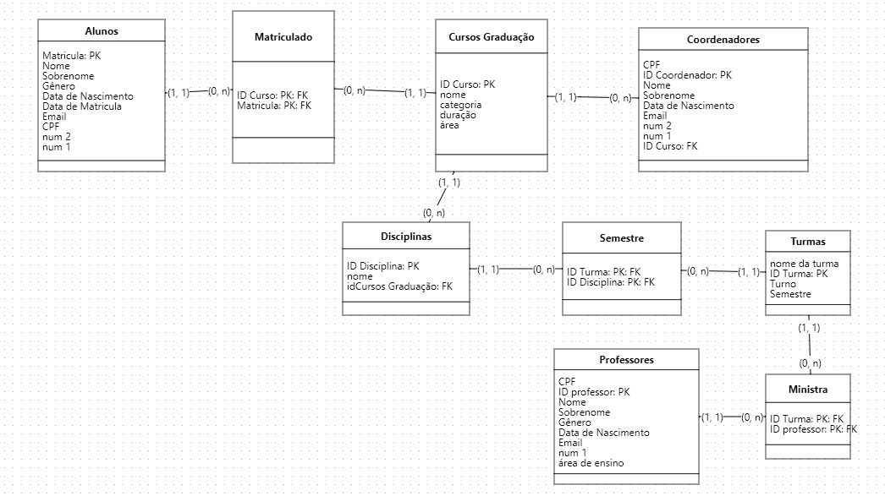

# Documentação

## Criação do Ambiente Virtual do Python Linux/Windows

Windows

```python
cd pasta_criada_para_o_projeto
py -m venv nome_ambiente # Cria ambiente

nome_ambiente/scripts/activate # Ativar ambiente
```

Linux

```python
virtualenv nome_ambiente # Cria  ambiente

source .venv/bin/activate # Ativar ambiente
```

# Inicializando Projeto

## Instalação pacote necessários no projeto

```python
pip install -r requirements.txt
```

Criando as Migrações e o Banco de Dados Db.sqlite

\*caso esteja pelo CMD

```python
py manage.py makemigrations && py manage.py migrate
```

Ou

```python
py manage.py makemigrations
py manage.py migrate
```

## Adicionando gmail ao projeto para servir de caminho

```console
>type nul > ".env"
```

Adicionar dentro da pasta .env

EMAIL_HOST_USER=gmail a ser ultilizado para enviar do sistema
EMAIL_HOST_PASSWORD=senha do app criada pelo gmail

Video Guia:
[Enviando Email com Django](https://www.youtube.com/watch?v=qhBhnjdZ-9g)

## Criação superuser para acesso inicial ao sistema

```python
 py manage.py createsuperuser
```

Acesso ao site

```python
py manage.py runserver
```


## Modelagem de banco de dados


Diagrama Conceitual ICA


Diagrama Lógico ICA
