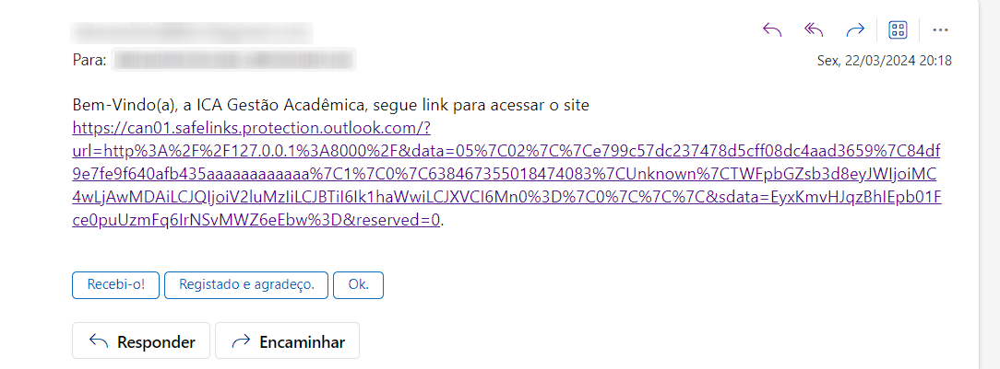
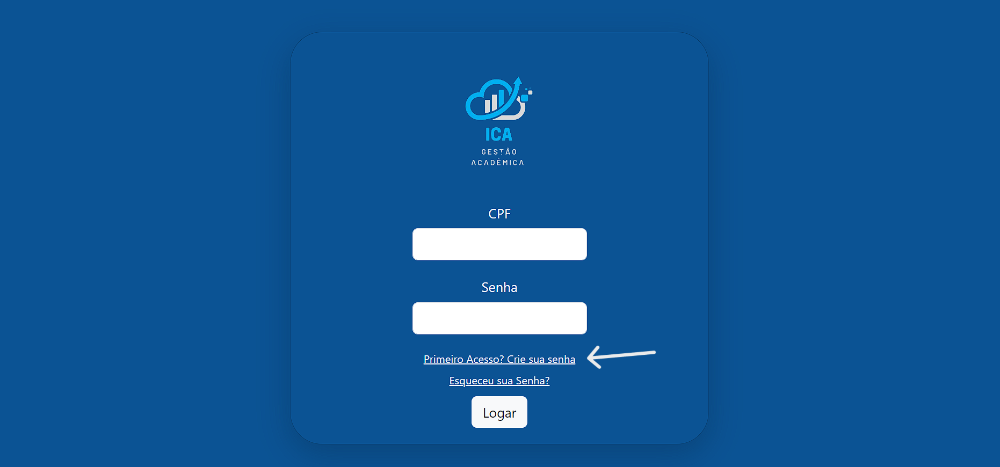
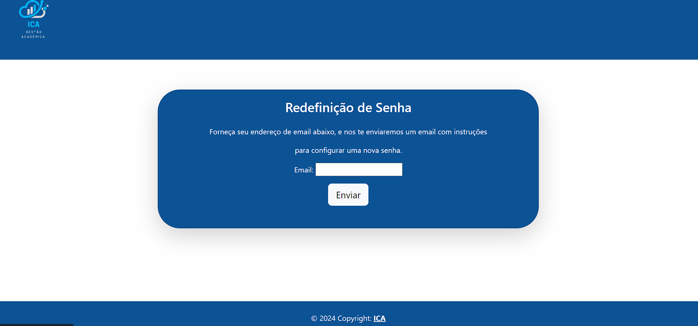
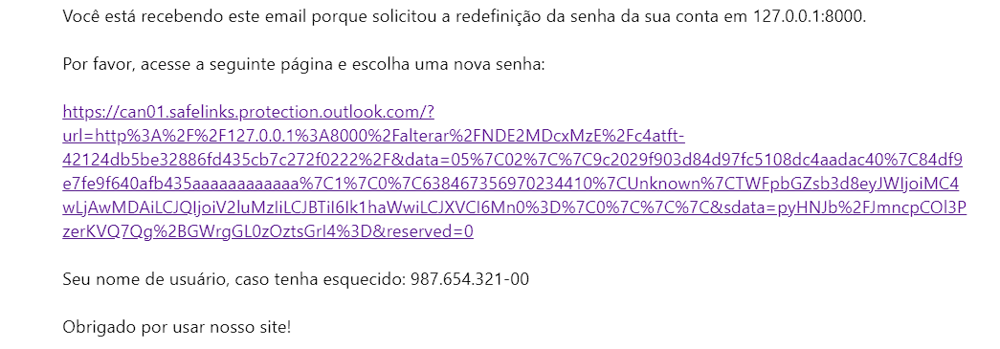

# Instruções de uso

## Olá, Usuário

Para a utilização desse sistema é necessária a criação de uma conta por parte da coordenação do curso de gradução, após o cadastro será enviado no seu email pessoal um link do site para acessar o site.

## Criação da Senha

Após receber o email de confirmação de cadastro será necessário a criação de uma senha própria para login.

Na tela de criação da senha basta fornecer seu email cadastrado para receber o link. 

Depois de acessar o link, basta seguir os passos mostrados na tela.

