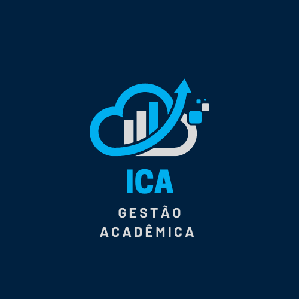

<!-- Adicione Badges das tecnologias que você usou aqui -->
<!-- Você pode encontrar badges aqui: https://github.com/Ileriayo/markdown-badges?tab=readme-ov-file#markdown-badges -->

**Este projeto foi desenvolvido como atividade final do curso de capacitação em Python da Cyber Edux, realizado de setembro de 2023 até março de 2024. Para mais informações, consulte o [enunciado](ENUNCIADO.md).**

# ICA Gestão Acadêmica - Inovação Constrante de Aprendizado

<!-- Substitua a seguinte imagem por uma logo do seu projeto -->

<!-- Substitua o seguinte parágrafo por um resumo do seu projeto: -->

O Projeto tem como objetivo de funcionalidade a gestão de notas e faltas dos alunos matriculados nos diferentes cursos de Graduação oferecidos de uma empresa de ensino. Esse sistema conta que facilitam o gerenciamento eficiente, entre as ferramentas temos Cadastro de Alunos, Professores e Coordenadores; Controle de Notas e faltas Os professores podem inserir as avaliações (atividades e provas) e calcular as médias automaticamente; Cadastros de Turmas; Cursos de Graduações e suas Disciplinas e Visualização de Notas e Faltas acessados pelos alunos.

## Documentação

- [Documentação (para desenvolvedores)](DOCUMENTACAO.md)
- [Manual (para usuários)](MANUAL.md)

## Sobre o autor

|                                                                                 |                                                                                                                                                                                                                                                                                                                                 |
| :-----------------------------------------------------------------------------: | :-----------------------------------------------------------------------------------------------------------------------------------------------------------------------------------------------------------------------------------------------------------------------------------------------------------------------------: |
|  **Alessandro Luís de Moraes** | Meu nome é Alessandro Luís de Moraes, tenho 18 anos faço aniversário no dia 23 de julho, sou Desenvolvedor de Sistemas Web, atualmente estou iniciando Curso Superior em Tecnologia - Análise e Desenvolvimento de Sistemas e estudando sobre diferentes formas de solucionar desafios contidos em meio ao mundo da área de TI. |
